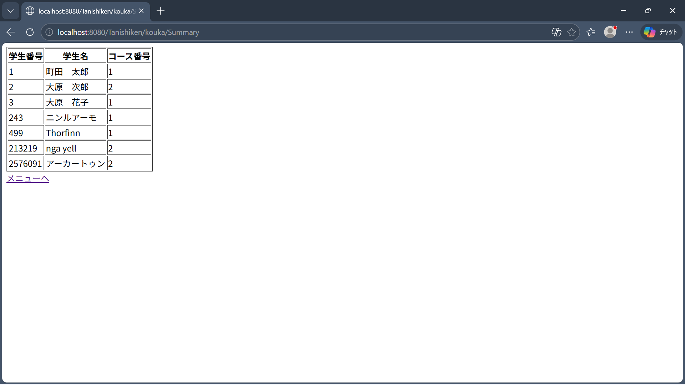
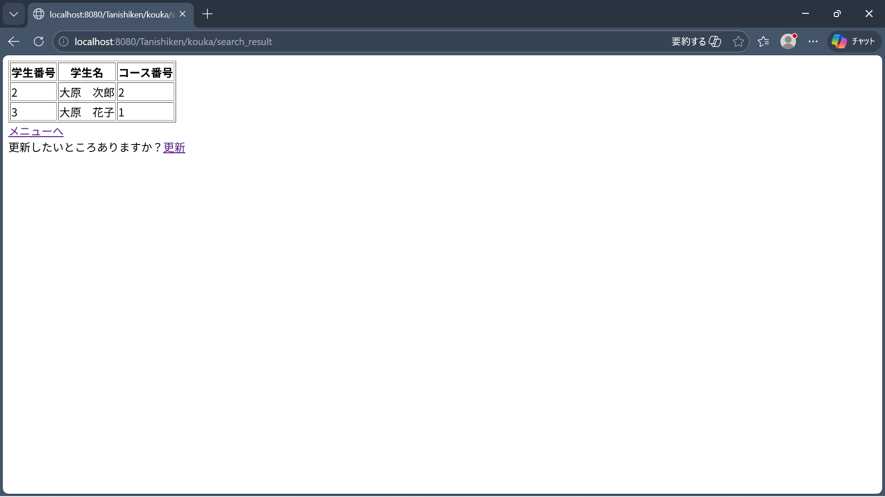
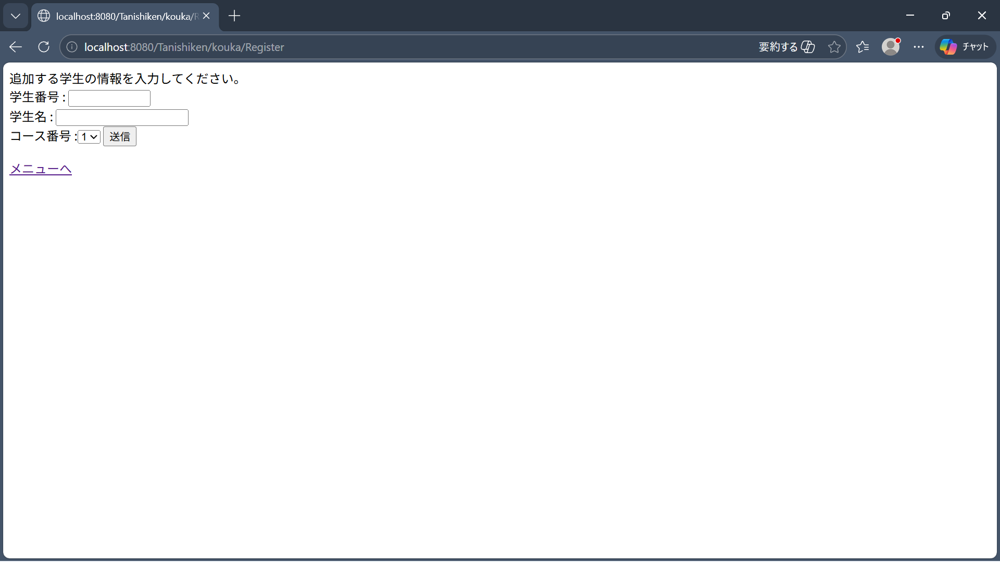
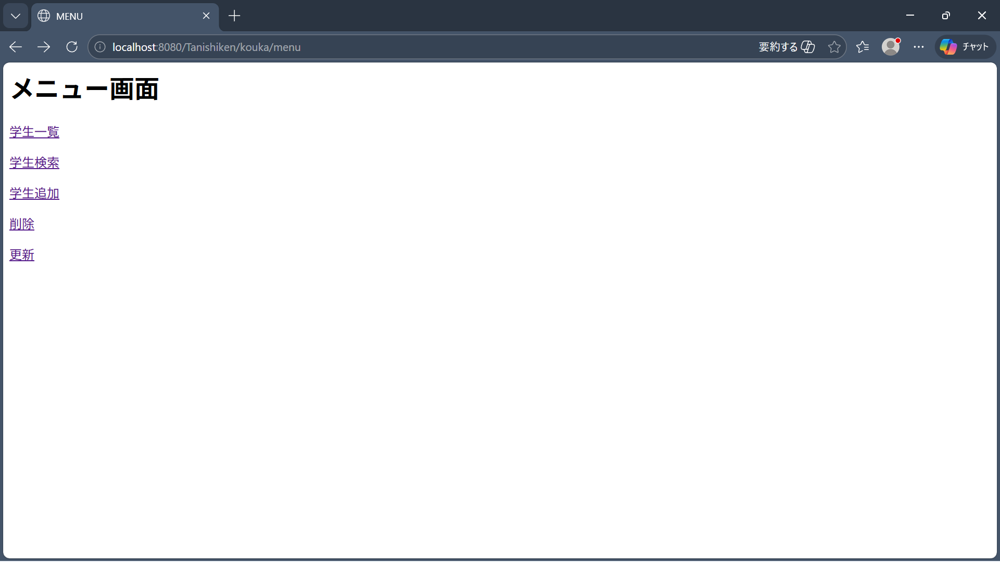

# 学生管理システム (Web Student Management System)

## 概要 (Overview)
JSP・Java・SQLを使用して、学生情報を管理するWebアプリケーションを作成しました。
ブラウザ上で学生の登録・検索・更新・削除が可能です。

## 機能 (Features)
- 学生の新規登録（Create）
- 学生情報の更新（Update）
- 学生の削除（Delete）
- 学生一覧表示（Read / Summary）
- 名前による検索（部分一致検索 LIKE）

## 使用技術 (Tech Stack)
- Java（Servlet / JSP）
- HTML / CSS
- H2（データベース）
- JDBC
- Apache Tomcat（サーバー）

## 画面 (Screens)
- 学生一覧画面
- 登録画面
- 検索結果画面

## 実行方法 (How to Run)
1. Apache Tomcatをインストール
2. Eclipseでプロジェクトをインポート
3. サーバー（Tomcat）を起動
4. ブラウザでアクセス

## データベース (Database)
- 学生テーブルを作成
- SQLファイルは /sql フォルダにあります

## 工夫した点 (Key Points)
- WebアプリとしてCRUD機能をすべて実装
- 名前の部分一致検索（LIKE）を実装
- MVC構造を意識して設計しました

## 今後の改善 (Future Improvements)
- デザイン改善（CSS）
- ログイン機能の追加
- バリデーション強化

## 画面 (Screenshots)

### 学生一覧画面
学生の一覧を表示する画面です。

### 検索機能
名前で検索できる機能です（部分一致対応）。

### 登録画面
新しい学生を登録する画面です。

### メニュー画面

